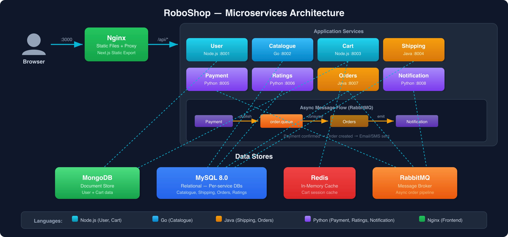

# 00-Overview

## Application Description

RoboShop Microservices is a cloud-native e-commerce application for robotics components. It consists of 9 services written in 5 programming languages, backed by 4 database types, with a Next.js static frontend served by Nginx.

## Architecture



## Components

| Service      | Technology  | Port | Database            | Purpose                                            |
|--------------|-------------|------|---------------------|----------------------------------------------------|
| Frontend     | Next.js     | 3000 | —                   | Static React UI served by Nginx                    |
| User         | Node.js     | 8001 | MongoDB             | User registration, login, and profile management   |
| Catalogue    | Go          | 8002 | MySQL               | Product listings and category browsing             |
| Cart         | Node.js     | 8003 | Valkey               | Shopping cart session management with TTL          |
| Shipping     | Java        | 8004 | MySQL               | Shipping cost calculation and delivery options     |
| Payment      | Python      | 8005 | RabbitMQ            | Payment processing; publishes order events         |
| Ratings      | Python      | 8006 | MySQL               | Product ratings and reviews                        |
| Orders       | Java        | 8007 | MongoDB + RabbitMQ  | Order creation, persistence, and event consumption |
| Notification | Python      | 8008 | RabbitMQ            | Email/SMS notifications triggered by order events  |

## Server Allocation

> **Important** Record the **private IP** of every server after creation — each service configuration references the private IPs of its database and upstream dependencies.

| Server    | AWS       | Azure         | OS      | Runs                  |
|-----------|-----------|---------------|---------|-----------------------|
| Server 1  | t3.small  | Standard_B1ms  | RHEL 10 | Nginx + Frontend      |
| Server 2  | t3.small  | Standard_B1ms  | RHEL 10 | MySQL                 |
| Server 3  | t3.small  | Standard_B1ms  | RHEL 10 | Catalogue Service     |
| Server 4  | t3.small  | Standard_B1ms  | RHEL 10 | MongoDB               |
| Server 5  | t3.small  | Standard_B1ms  | RHEL 10 | User Service          |
| Server 6  | t3.small  | Standard_B1ms  | RHEL 10 | Valkey                 |
| Server 7  | t3.small  | Standard_B1ms  | RHEL 10 | Cart Service          |
| Server 8  | t3.small  | Standard_B1ms  | RHEL 10 | Shipping Service      |
| Server 9  | t3.small  | Standard_B1ms  | RHEL 10 | RabbitMQ              |
| Server 10 | t3.small  | Standard_B1ms  | RHEL 10 | Payment Service       |
| Server 11 | t3.small  | Standard_B1ms  | RHEL 10 | Notification Service  |
| Server 12 | t3.small  | Standard_B1ms  | RHEL 10 | Orders Service        |
| Server 13 | t3.small  | Standard_B1ms  | RHEL 10 | Ratings Service       |

## Prerequisites

Before setting up any component, disable SELinux and the firewall on all servers:

```shell
setenforce 0
systemctl stop firewalld
systemctl disable firewalld
```

> **Note** In production, configure SELinux policies and firewall rules properly instead of disabling them.

## Setup Order

The setup follows the **UI journey** — each step unlocks a new feature visible in the browser.

1. **Frontend / Nginx** — set up first; the storefront loads but all API calls fail (demonstrates the problem)
2. **MySQL** — shared relational database needed by Catalogue, Ratings, and Shipping
3. **Catalogue Service** — product listings and categories now appear in the UI
4. **MongoDB** — document store needed by User Service
5. **User Service** — registration and login now work in the UI
6. **Valkey** — in-memory store needed by Cart Service
7. **Cart Service** — add-to-cart functionality now works
8. **Shipping Service** — shipping cost calculation works at checkout
9. **RabbitMQ** — message broker needed by Payment, Orders, and Notification
10. **Payment Service** — checkout and payment flow now works
11. **Notification Service** — must be up before Orders since Orders calls it on order creation
12. **Orders Service** — order history and confirmation now appear after payment
13. **Ratings Service** — product star ratings now display and can be submitted
